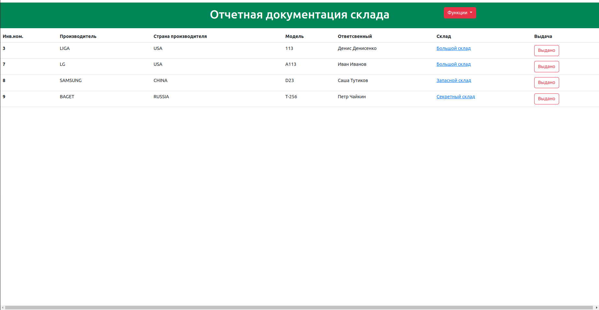
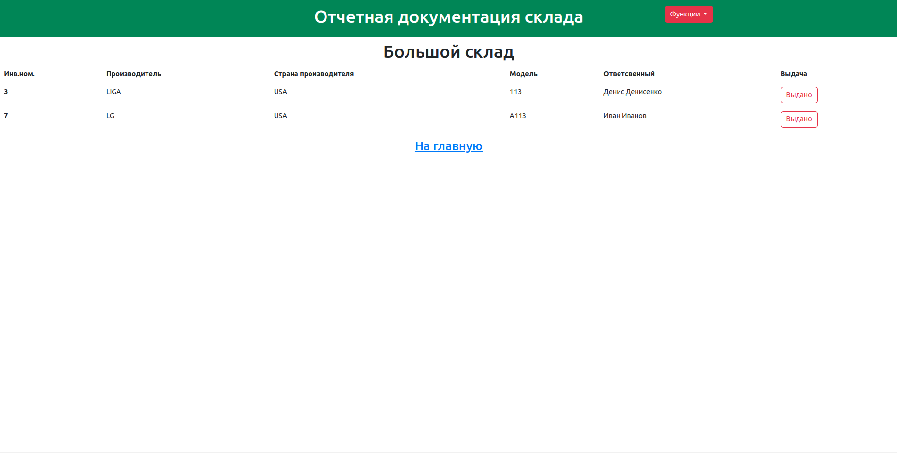
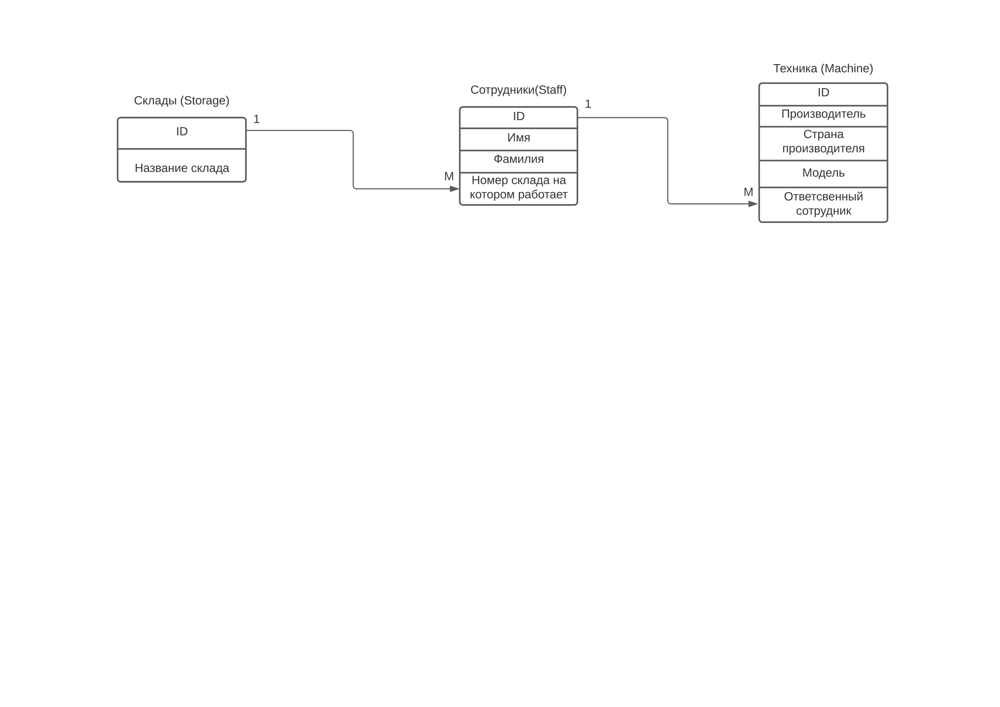

<h2>Проект организации складов </h2> 

В некой фирме существует система складов, которые можно создавать, удалять, назначать на конкретный склад работника, 
и закреплять за ним некоторую технику.

База данных построена таким образом, что техника закрепляется за челвоеком, а человек закрепленн за складом, для
избежания возникновения ошибок, что человек должен отвечать за технику которая находится на разных складах

На главной    странице приложения отоброжается общая информация о техники в наличии, о том, кто за нее отвечает и где 
находится необходимая модель

Как видно на изображении, наименования скалада являются ссылками и возможно перейти к отображению документации
конкретного склада

При нажатии кнопочки "Выдано" запись удаляется из базы данных

Когда объекты на складе заканчиваются появляется кнопочка "Удалить склад", что бы можно было его закрыть

В приложении реализован интерфейс для добавления всех позиций, необходимых для реализации базы данных

Приложение можно расширять, изменив допустим модель персонала на абстрактоного Юзера и делать отчеты
для каждого человека

Так же прикладываю схему базы данных

